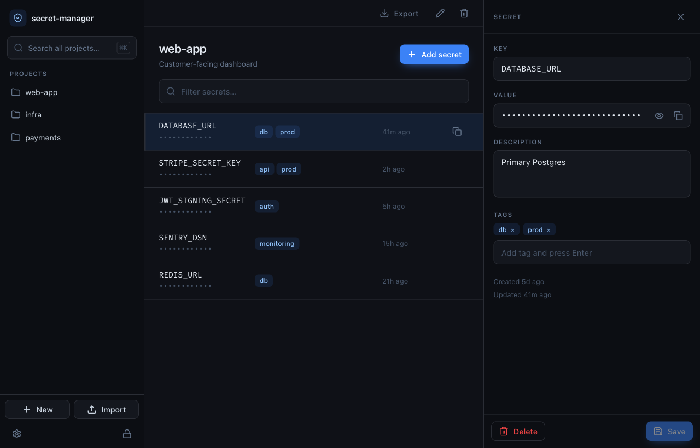
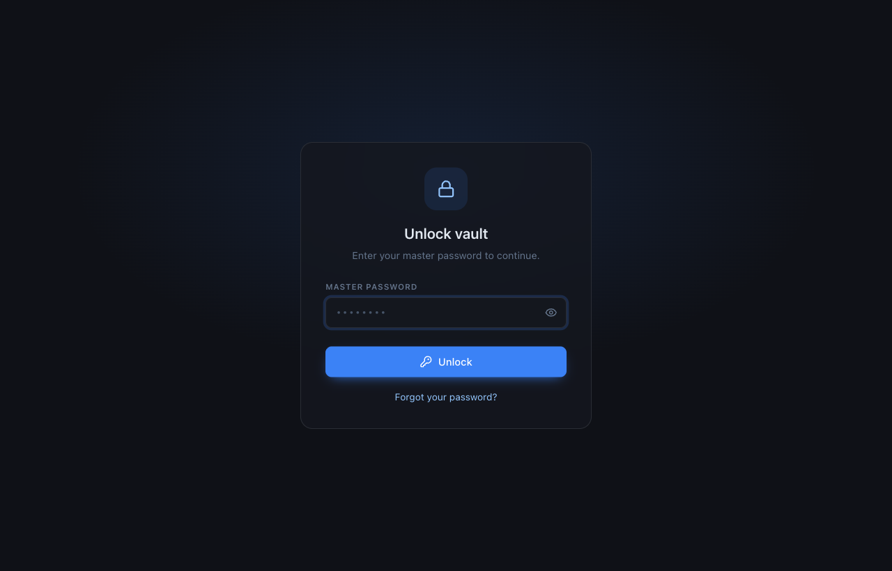
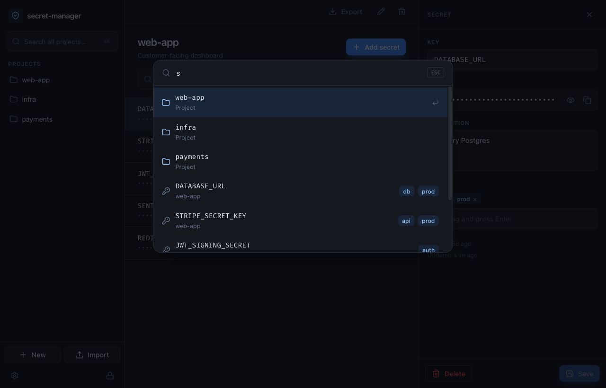
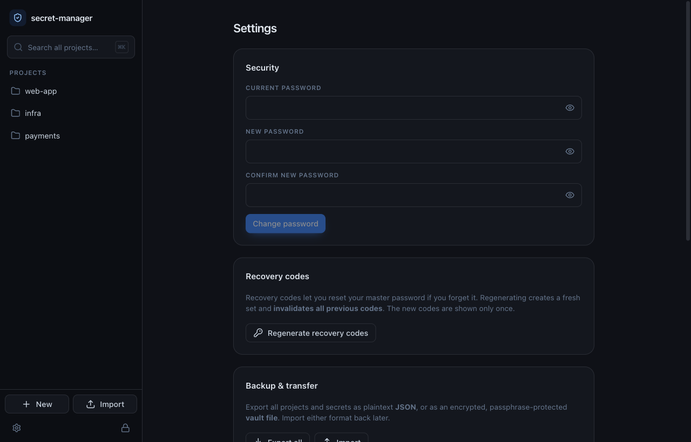
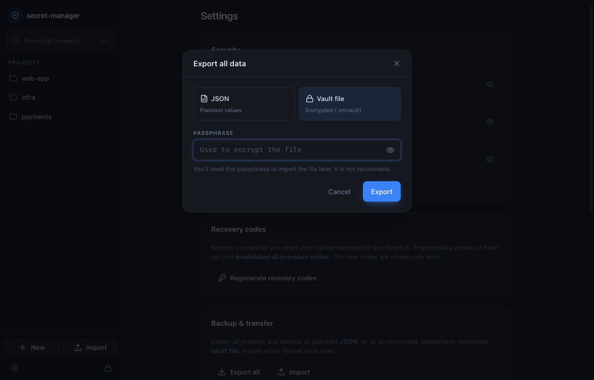

<div align="center">

# 🔐 secret-manager

**A local-first, end-to-end encrypted desktop vault for your project secrets and environment variables.**

Built for developers who are tired of plaintext `.env` files scattered across machines.
Master-password protected, recovery-code backed, and it never phones home.

Tauri 2 · Rust · React · TypeScript · SQLCipher · Argon2id · AES-256-GCM



</div>

---

## Why

`.env` files are plaintext, easy to leak, and a pain to share or move between machines.
secret-manager keeps your secrets in a single encrypted vault, organized by project, searchable, and unlocked by one master password — with recovery codes so a forgotten password isn't the end of the world.

## Features

- 🔒 **Encrypted at rest** — the entire vault database is sealed with **SQLCipher** (full-disk, not just values); the master key is derived from your master password with Argon2id (64 MB, t=3, p=4) and lives in memory only.
- 🗝️ **Master-password recovery** — single-use recovery codes can reset a forgotten password without re-encrypting anything (envelope encryption).
- 👆 **Touch ID unlock (macOS)** — enroll once, then unlock with Face ID/Touch ID instead of typing your password.
- 🛡️ **Password-strength meter** — warns on weak master passwords at creation/change/recovery (never blocks).
- ⏳ **Unlock rate limiting** — repeated failed attempts trigger a temporary, capped backoff, not a permanent lockout.
- 📁 **Projects, secrets & tags** — group secrets per project, tag them, copy with auto-clearing clipboard.
- 🔎 **Global search (⌘K)** — a command palette that searches across *all* projects, both project names and secrets.
- 📦 **Export / import** — back up to plaintext **JSON** or an encrypted, passphrase-protected **vault file** (`.smvault`); export the whole vault or a single project (right-click a project, or use its header).
- ⏱️ **Auto-lock & clipboard auto-clear** — configurable inactivity lock; copied values wiped after a timeout.
- 🌗 **Dark / light / system theme**, show-password toggles, keyboard-first.
- 🖥️ **Cross-platform** — macOS, Windows, Linux from one Rust + web codebase (Touch ID is macOS-only).

## Screenshots

| Unlock / recovery | Global search (⌘K) |
|---|---|
|  |  |

| Settings | Encrypted export |
|---|---|
|  |  |

## Security model

- The master password is **never stored**. A random 32-byte **master key** both
  encrypts the **entire vault database** (full-disk encryption via **SQLCipher**,
  raw-key mode — not just secret values) and is itself *wrapped* (envelope
  encryption) by:
  - a key derived from your **master password** via **Argon2id**, and
  - a key derived from each **recovery code**, and
  - optionally, on macOS, a token released by **Touch ID / Face ID**.
- **Unlock** derives the password key, decrypts the master-key wrap, verifies
  it, then opens the SQLCipher-keyed database. **Changing the password** or
  **recovering** only re-wraps the master key — the database is never
  re-encrypted.
- Everything in the database — project names, secret keys, descriptions,
  tags, and values — is opaque ciphertext on disk without the master key.
  Secret values additionally use **AES-256-GCM** (`ring`) at the field level,
  layout `nonce(12) || ciphertext || tag`; tampering fails authentication.
- Pre-unlock metadata (KDF parameters, the wrapped master key, recovery
  wraps, the verify blob, rate-limit counters, and the optional biometric
  wrap) lives in a plaintext sidecar file, `vault.db.meta.json`, next to the
  vault — it has to be readable before the master key exists to open the
  database. It contains no secret values and no way to derive the master key
  without the password/recovery code/biometric token.
- **Repeated failed unlocks are throttled** with an exponential backoff (5s →
  15s → 30s → 60s → capped at 5 min), persisted across restarts. It's
  temporary and bounded — never a permanent lockout.
- **macOS Touch ID**: enroll from Settings once unlocked; a random token
  gated by biometry is stored in the Keychain and wraps the master key.
  Unlocking prompts Touch ID/Face ID, unwraps the master key from the
  Keychain token, and opens the vault — no password typing required.
  Disable anytime; the password always still works.
- Vaults created before this encryption model (plaintext SQLite, only secret
  values encrypted) are **migrated automatically on first unlock**: your
  data moves into the new SQLCipher-encrypted file, and the original
  plaintext file is kept as a one-time `<vault>.bak` rather than deleted, so
  an interrupted migration can't lose data. That `.bak` is plaintext — delete
  it manually once you've confirmed the migrated vault works (there isn't a
  dedicated button for this yet; the file is only cleaned up automatically if
  you delete the whole vault).
- The master key is **zeroized** on lock. See [docs/ARCHITECTURE.md](docs/ARCHITECTURE.md) for the full threat model.

> ⚠️ **Recovery codes** are shown once at vault creation (and on regenerate). Each works one time. Without the password, a recovery code, **and** without an enrolled biometric, a vault cannot be decrypted — there is no backdoor.
>
> ⚠️ **JSON export** contains secret values in **plaintext**. Prefer the encrypted **vault file** for backups you keep around; store any plaintext export securely.
>
> ⚠️ A password-strength meter (zxcvbn) warns about weak master passwords on create/change/recover — it never blocks you from using one anyway.

## Backup, recovery & transfer

- **Forgot your password?** Unlock screen → *Forgot your password?* → enter a recovery code → set a new password.
- **Export** — Settings → *Backup & transfer* → *Export all* (choose JSON or encrypted vault file). Single project: its page header, or right-click it in the sidebar.
- **Import** — Settings → *Import*, or the sidebar **Import** button. Encrypted files prompt for the passphrase; duplicate keys resolved by *skip* / *overwrite*.

## Quick start

```bash
# Prerequisites: Rust (stable), Node.js 20+, platform webview deps
#   macOS: bundled · Linux: WebKitGTK · Windows: WebView2
npm install
npm run tauri dev      # launch the desktop app with hot reload
```

First launch prompts you to **create a vault** and **save recovery codes**. After that you get the unlock screen.

### Build installers

```bash
npm run tauri build    # native installers in src-tauri/target/release/bundle
```

## Test

```bash
cd src-tauri && cargo test   # Rust: crypto, vault + recovery + rate-limit + biometric wrap,
                             #       sidecar, legacy migration, SQLCipher keyed DB, repo CRUD,
                             #       export/import (JSON + encrypted), persistence
npm test                     # Frontend: vitest (utils, stores, components, strength meter)
npm run typecheck            # tsc --noEmit
```

## Architecture

```
src-tauri/src/
  crypto.rs     Argon2id KDF + AES-256-GCM encrypt/decrypt
  vault.rs      create / unlock / change-password / recovery / rate-limit / biometric wrap
  sidecar.rs    vault.meta.json — pre-unlock KDF params, wraps, verify blob, rate-limit + biometric state
  migrate.rs    one-time legacy plaintext vault → SQLCipher v3 migration (keeps a .bak)
  biometric.rs  macOS Keychain token store gated by Touch ID/Face ID (no-op elsewhere)
  repo.rs       projects / secrets / tags CRUD + search
  transfer.rs   export / import bundle — plaintext JSON + encrypted vault file
  db.rs         SQLite open (plain + SQLCipher-keyed), pragmas, versioned migrations
  state.rs      session state (master key behind a Mutex, zeroized on lock)
  commands/     IPC: vault.rs, projects.rs, secrets.rs, transfer.rs
src/
  lib/          typed invoke() wrappers, types, clipboard, transfer flows, passwordStrength.ts
  store/        Zustand: vault (session), settings (persisted), ui (palette)
  components/   Sidebar, SecretList, SecretDetail, UnlockScreen, CommandPalette,
                RecoveryCodes, TransferDialogs, StrengthMeter, …
  pages/        Home, Project, Settings
```

> The IPC commands behind Argon2id (unlock, create, change-password, recover,
> encrypted export/import) and the biometric commands (enroll/unlock/disable)
> are `async` so heavy key derivation and Keychain/Touch ID round-trips run off
> the UI thread — button spinners and loading state stay responsive.

See [docs/ARCHITECTURE.md](docs/ARCHITECTURE.md) for encryption detail and [docs/ROADMAP.md](docs/ROADMAP.md) for what's next (team sync, `.env` import/export, secret history).

## License

See [LICENSE](LICENSE).
